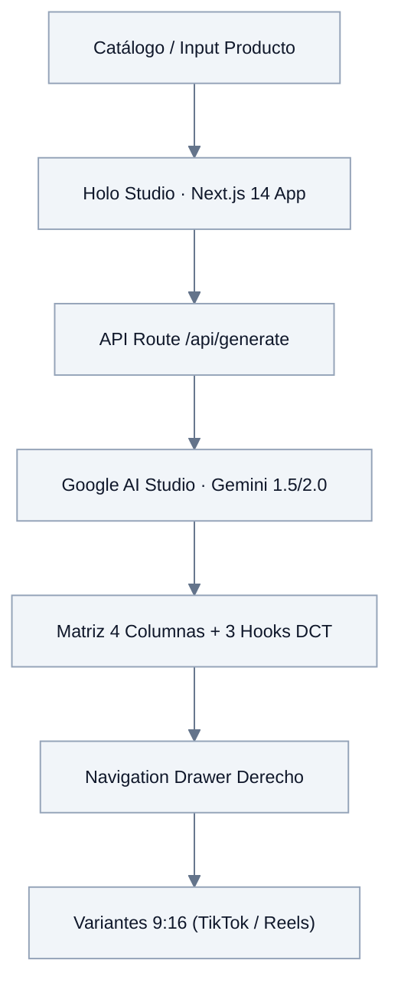

# TECHNICAL ARCHITECTURE & DATA TOPOLOGY

### Pipeline de Medición
1. Frontend: Disparo de evento e-commerce con generación de UUID criptográfico (`window.crypto.randomUUID()`).
2. Capa Web: GTM Web recibe el Data Layer y dispara el Pixel de Meta con `{ eventID: event_id }` y GA4 Tag.
3. Capa Servidor: GTM Server-Side decodifica el evento GA4 y emite un POST HTTPS a Meta CAPI conservando el mismo `event_id`.
4. Deduplicación: Meta Event Manager empareja y unifica ambos eventos mediante `event_id`.

### Topología MCP (`.agent/mcp_config.json`)
* `meta-marketing-mcp` & `google-ads-mcp`: Control programático de campañas y reporting.
* `ecommerce-database-mcp`: Consulta directa de márgenes (COGS) y stock disponible.
* `browser-automation-mcp`: Simulación y validación de triggers y tags en tiempo real.
* `google-merchant-mcp`: Auditoría y feed sync.
* `filesystem-mcp`: Manipulación de archivos locales y sincronización de `./docs`.
* `fetch-http-mcp`: Endpoints Graph API y microservicios server-side.

### Arquitectura y Encapsulamiento del Agente (`.agent/`)
* `.agent/AGENT.md`: Directivas operativas de alto nivel y reglas de negocio obligatorias.
* `.agent/agent.yaml`: Manifiesto canónico de configuración y políticas de ejecución.
* `.agent/rules.md`: Restricciones operativas y estándares de codificación.
* `.agent/workflows.md`: Definición descriptiva de flujos de trabajo.
* `.agent/skills/`: Paquetes de habilidades modulares (Progressive Disclosure) para ejecución de procedimientos complejos.
* `.agent/mcp_config.json`: Configuración ejecutable de servidores MCP.

### Holo Studio (`apps/holo-studio/`)
Suite web local de generación y edición de video vertical (9:16) en formato DCT (3 Hooks, 2 Bodies, 2 CTAs) con coste de software $0 USD, desarrollada en **Next.js 14, React 18, TypeScript, Tailwind CSS y Lucide Icons**:
* **Top Header Sticky:** Barra superior con marca `HOLO STUDIO`, indicador central de etapa activa y botón hamburguesa (`#btn-open-drawer`) en el extremo derecho.
* **Navigation Drawer Derecho:** Panel deslizante anclado a la derecha (`fixed top-0 right-0 h-full w-80 z-50`), con fondo desenfocado (*backdrop blur*), control de cierre, conmutación de temas, selector de modelos y guardrails.
* **Sistema de 5 Temas (`src/styles/themes.ts`):** *Omarchy Tiling* (predeterminado), *Omarchy Aetherial*, *Soft Pastel*, *Dark Glass* y *Cyberpunk Glass*. Cumple la regla canónica: **el color rojo está estrictamente prohibido en Omarchy** (sustituido por esmeralda `#A6DA95`, cobalto `#BD93F9` y ámbar `#F1FA8C`).
* **Motor Creativo & IA (`/api/generate`):** Conexión directa a la API REST de Google AI (Gemini 1.5/2.0 Flash) para generar la Matriz Canónica de 4 Columnas (0-3s Hook, 3-10s Agitación, 10-22s Mecanismo, 22-30s CTA) y 3 Hooks DCT.

