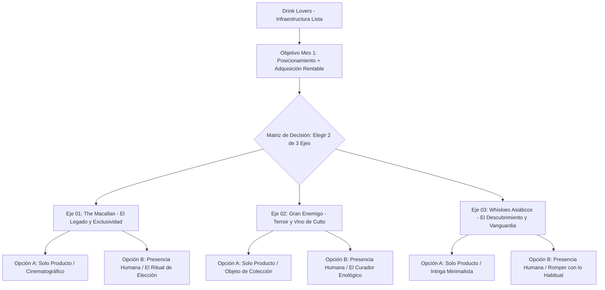
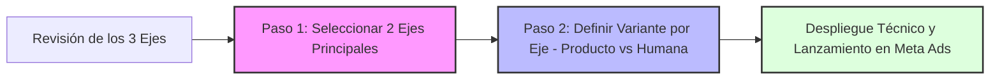
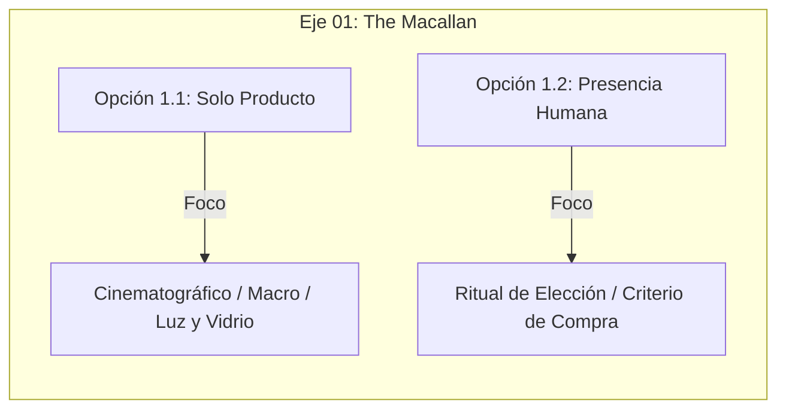
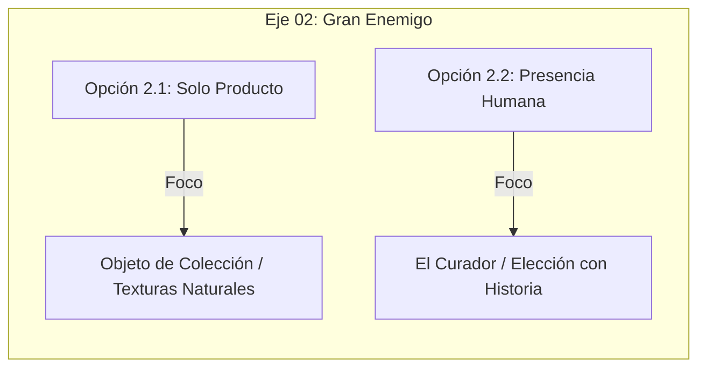
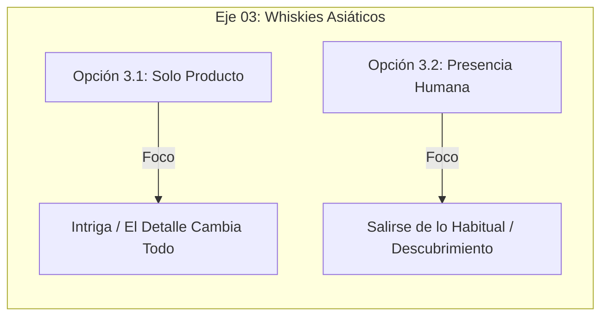
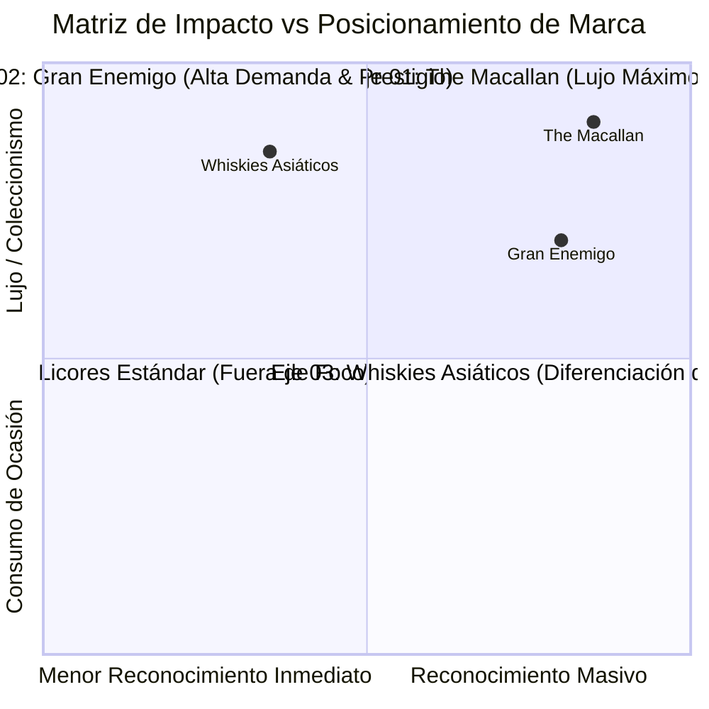
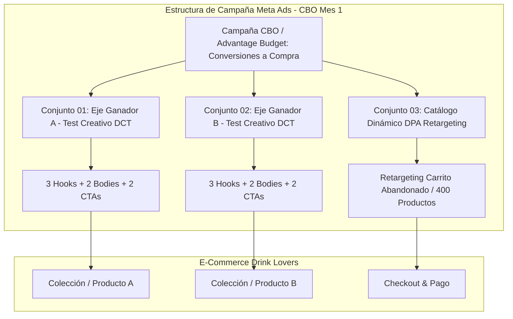
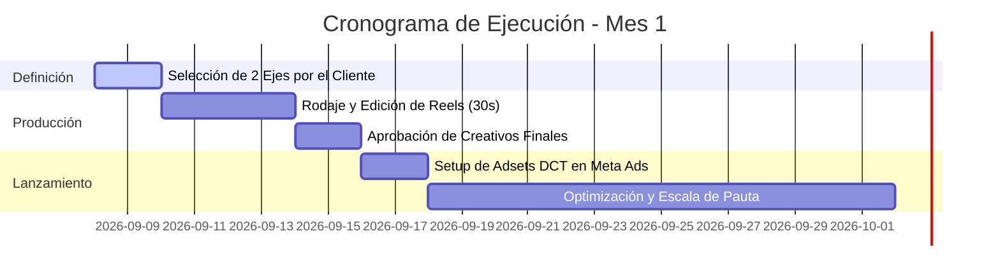

# PROPUESTA ESTRATÉGICA META ADS — MES 1
**Cliente:** Drink Lovers  
**Fecha de Presentación:** Septiembre 2026  
**Responsable:** Dirección de Performance & Estrategia Digital  
**Canal de Ejecución:** Meta Ads (Facebook & Instagram Ads)  

---

## 1. VISIÓN EJECUTIVA Y CONTEXTO ESTRATÉGICO

Drink Lovers cuenta hoy con activos digitales y de infraestructura listos para operar a escala:
* Dominio validado y verificado en Meta Business Suite (`drinklovers.com.ar`).
* Catálogo de productos sincronizado en Tiendanube con 400 referencias cargadas.
* Telemetría activa: Meta Pixel y Conversions API (CAPI) deduplicados y recibiendo eventos en vivo.

El objetivo central del **Mes 1** no es quemar presupuesto publicitario en ofertas de volumen o descuentos que erosionen la marca. En este primer ciclo, el propósito es **construir posicionamiento de alta gama, traccionar tráfico altamente calificado y generar conversiones directas de tickets medios y altos (AOV elevado)**. 

Para lograrlo, transformamos las botellas en **objetos de colección, criterio y deseo**, alejándonos del típico anuncio ruidoso de licorería y adoptando códigos visuales propios de la alta perfumería, relojería suiza y boutiques enológicas de culto.

---

## 2. METODOLOGÍA DE ELECCIÓN: CÓMO TOMAR LA DECISIÓN

Diseñamos **3 grandes líneas estratégicas de producto**. Cada una responde a una emoción motriz diferente y a un segmento específico de compradores.

> **Regla de Definición para el Mes 1:**  
> Te pedimos que selecciones **2 de las 3 opciones principales**.  
> Una vez elegidos los 2 ejes que mejor representen hacia dónde visualizas llevar a Drink Lovers este mes, definiremos dentro de cada uno cuál de sus **2 variantes de producción** (Solo Producto vs Presencia Humana) ejecutamos en la fase de filmación y testeo dinámico.

---

## 3. LOS 3 EJES ESTRATÉGICOS EN DETALLE

---

### EJE 01 — THE MACALLAN: EL LEGADO Y LA EXCLUSIVIDAD ABSOLUTA
* **Pilar:** Exclusividad y Prestigio Internacional.
* **Emoción Principal:** Deseo de estatus, sofisticación y consagración.
* **Público Objetivo:** Amantes del single malt de alta gama, compradores de regalos corporativos de lujo, coleccionistas y perfiles de alto poder adquisitivo.
* **Tesis Comercial:** Posiciona a Drink Lovers como la tienda de referencia indiscutida para adquirir el whisky más prestigioso del mundo, justificando tickets promedio muy elevados.

#### Variante 1.1: Enfoque 100% Producto (Cinematográfico / Macro)
* **Concepto:** *“No es una botella. Es The Macallan.”*
* **Formato y Duración:** Video vertical 9:16 — 30 segundos.
* **Tratamiento Visual:** Luz lateral y rasante, macros extremos de sellos, etiquetas y color ámbar del líquido a través del cristal.
* **Estructura Técnica:**
  * `00–03s`: Pantalla casi negra. Luz cálida revela la silueta. Clack seco de vidrio. Hook: *“No todas las botellas cuentan una historia.”*
  * `03–13s`: Montaje progresivo de expresiones (etiqueta, packaging, tapón). *“…construyeron un legado.”*
  * `13–21s`: Caída sutil en copa o rotación del líquido en slow motion.
  * `21–30s`: Revelación de toda la colección disponible en la tienda. CTA directo a catálogo.
* **Ventaja:** Cero costo de actores; producción 100% controlada; máxima estética editorial.

#### Variante 1.2: Presencia Humana (El Ritual de la Elección)
* **Concepto:** *“Elegir también es parte del ritual.”*
* **Formato y Duración:** Video vertical 9:16 — 30 segundos.
* **Tratamiento Visual:** Interacción humana elegante frente a estantería. **Botellas siempre cerradas** (no se abren ni se beben; permanecen 100% intactas para la venta).
* **Estructura Técnica:**
  * `00–03s`: Persona entra en cuadro, coloca una botella sobre la mesa con firmeza. *“No se trata de elegir cualquier whisky.”*
  * `03–18s`: La persona recorre la colección, compara expresiones con la mirada y selecciona una botella por su carácter y añada.
  * `18–30s`: *“Cuando la elección importa, el detalle hace la diferencia.”* La persona queda en segundo plano desenfocada; la colección Macallan queda en foco absoluto.
* **Ventaja:** Humaniza la marca; transmite criterio y asesoramiento de boutique especializada.

---

### EJE 02 — GRAN ENEMIGO: TERROIR, COLECCIÓN Y VINO DE CULTO
* **Pilar:** Identidad Argentina, Terroir de Altura y Prestigio Enológico.
* **Emoción Principal:** Pertenencia, sofisticación terrenal y valorización del origen.
* **Público Objetivo:** Consumidores frecuentes de vinos de autor, enófilos, compradores que buscan impresionar en cenas o agasajos premium.
* **Tesis Comercial:** Aprovecha el reconocimiento masivo de Gran Enemigo (Catena Zapata) para captar volumen calificado con excelente margen bruto, demostrando que Drink Lovers tiene stock de añadas difíciles de conseguir.

#### Variante 2.1: Enfoque 100% Producto (Texturas de Terroir y Cristal)
* **Concepto:** *“Hay vinos que se toman. Otros se recuerdan.”*
* **Formato y Duración:** Video vertical 9:16 — 30 segundos.
* **Tratamiento Visual:** Estética enológica, sombras profundas, maderas oscuras y piedra. Botella exhibida como pieza de diseño.
* **Estructura Técnica:**
  * `00–03s`: Fondo oscuro. Un haz de luz descubre la silueta y cápsula de Gran Enemigo. Hook verbal: *“Hay vinos que se toman…”*
  * `03–14s`: Recorrido macro por la gráfica de la etiqueta. Cortes dinámicos pero elegantes. *“…y otros que se recuerdan. Territorio. Altura. Tiempo.”*
  * `14–22s`: Luz cálida atraviesa el cuerpo de la botella cerrada destacando el brillo granate.
  * `22–30s`: Revelación de las distintas expresiones de Gran Enemigo en stock. CTA a la tienda.
* **Ventaja:** Genera deseo inmediato de compra; destaca la belleza física de la botella cerrada.

#### Variante 2.2: Presencia Humana (El Curador Enológico)
* **Concepto:** *“El buen vino no se elige al azar.”*
* **Formato y Duración:** Video vertical 9:16 — 30 segundos.
* **Tratamiento Visual:** Una persona con porte sobrio y seguro que examina las botellas como quien elige una joya o una pieza de arte. Cero saludos informales de influencers.
* **Estructura Técnica:**
  * `00–03s`: Persona frente a la línea Gran Enemigo. Toma una botella con seguridad y la apoya con un toque limpio en mesa. *“El buen vino no se elige al azar.”*
  * `03–15s`: Observa etiquetas, añadas y procedencias. *“Se elige por su historia. Por su origen. Por su carácter.”*
  * `15–23s`: Toma la botella elegida a la altura del pecho y mira a cámara: *“Eso es lo que hace diferente a Gran Enemigo.”*
  * `23–30s`: Presentación de la línea completa disponible en Drink Lovers.
* **Ventaja:** Posiciona a Drink Lovers como un curador experto, no un simple despachador de cajas.

---

### EJE 03 — WHISKIES ASIÁTICOS: EL DESCUBRIMIENTO Y LA VANGUARDIA
* **Pilar:** Vanguardia, Curiosidad, Minimalismo Oriental e Innovación.
* **Emoción Principal:** Intriga, distinción por salir de lo clásico y deseo de explorar.
* **Público Objetivo:** Consumidores que ya probaron el scotch tradicional y buscan diferenciarse con destilados japoneses o taiwaneses de culto.
* **Tesis Comercial:** Posicionamiento disruptivo. Despega a Drink Lovers del 99% de las vinotecas tradicionales que solo promocionan marcas masivas, atrayendo a un público exigente que paga por novedad y exclusividad.

#### Variante 3.1: Enfoque 100% Producto (Intriga Minimalista)
* **Concepto:** *“El detalle cambia todo.”*
* **Formato y Duración:** Video vertical 9:16 — 30 segundos.
* **Tratamiento Visual:** Estética inspirada en la alta relojería y perfumería japonesa. Fondos negros, caligrafía, texturas de papel y madera oscura.
* **Estructura Técnica:**
  * `00–06s`: Macro extremo de una textura o caligrafía. No se muestra qué producto es. Hook: *“¿Qué hace extraordinario a un whisky? No es solo el whisky.”*
  * `06–18s`: Sonidos ASMR de vidrio y madera. Luces que van desvelando precisión, tiempo y paciencia.
  * `18–26s`: Tensión y revelación: se destapa que son whiskies asiáticos premium de destilerías seleccionadas.
  * `26–30s`: Hero shot de la colección con llamada a descubrir el nuevo estándar en Drink Lovers.
* **Ventaja:** Retención altísima de video (Hold Rate superior al 25%) por el misterio de los primeros segundos.

#### Variante 3.2: Presencia Humana (Romper con lo Convencional)
* **Concepto:** *“No todos buscan lo mismo.”*
* **Formato y Duración:** Video vertical 9:16 — 30 segundos.
* **Tratamiento Visual:** Persona que explora la tienda, pasa de largo los whiskies convencionales y se detiene deliberadamente en la sección asiática.
* **Estructura Técnica:**
  * `00–07s`: Persona frente a la estantería general: *“No todos buscan el mismo whisky. Algunos buscan lo conocido…”*
  * `07–19s`: Su mano pasa de largo las botellas clásicas y toma una expresión japonesa: *“…otros buscan descubrir. Y ahí es donde empieza lo interesante.”*
  * `19–30s`: Compara matices: *“Whiskies nacidos de otra mirada. Si querés salir de lo habitual, empezá por acá.”* Presentación final de catálogo.
* **Ventaja:** Quiebra el patrón de consumo estándar y activa la compra por curiosidad intelectual y paladar refinado.

---

## 4. CUADRO COMPARATIVO PARA LA TOMA DE DECISIÓN

| Eje Estratégico | Atractivo Principal | Emoción Dominante | Ticket Promedio (AOV) | Rol en el Mix del Mes 1 |
| :--- | :--- | :--- | :--- | :--- |
| **01. The Macallan** | Prestigio global y herencia indiscutida | Exclusividad y aspiracionalidad | **Muy Alto** (Tier 3) | Generador de autoridad de marca y margen bruto neto. |
| **02. Gran Enemigo** | Culto al terroir y validación de Catena | Sofisticación y orgullo enológico | **Medio - Alto** (Tier 2) | Tracción de volumen calificado con alta rotación en tienda. |
| **03. Whiskies Asiáticos** | Vanguardia y sofisticación alternativa | Curiosidad y descubrimiento | **Alto** (Tier 2/3) | Diferenciador competitivo frente a vinotecas tradicionales. |

---

## 5. ARQUITECTURA TÉCNICA DE CAMPAÑA EN META ADS

Una vez elegidas las **2 opciones**, desplegaremos una estructura de tráfico y conversión basada en testing dinámico (DCT) y optimización CBO:

### Protocolo de Producción (Seguridad de Stock)
* **Las botellas NUNCA se abren ni se sirven.**  
* Se filman 100% cerradas, limpias y selladas, funcionando como objetos de deseo de alta gama.
* Esto preserva el 100% del inventario comercializable de Drink Lovers sin pérdidas operativas.

---

## 6. PRÓXIMOS PASOS (PLAN DE ACCIÓN INMEDIATO)

1. **Tu Definición:** Indicar cuáles son los **2 ejes** seleccionados (Macallan, Gran Enemigo o Whiskies Asiáticos).
2. **Definición de Variante:** Confirmar si prefieres la versión **Solo Producto** o con **Presencia Humana** para cada uno.
3. **Plan de Rodaje:** Con la definición tomada, procedemos a la pauta de filmación plano por plano y el posterior montaje publicitario.
